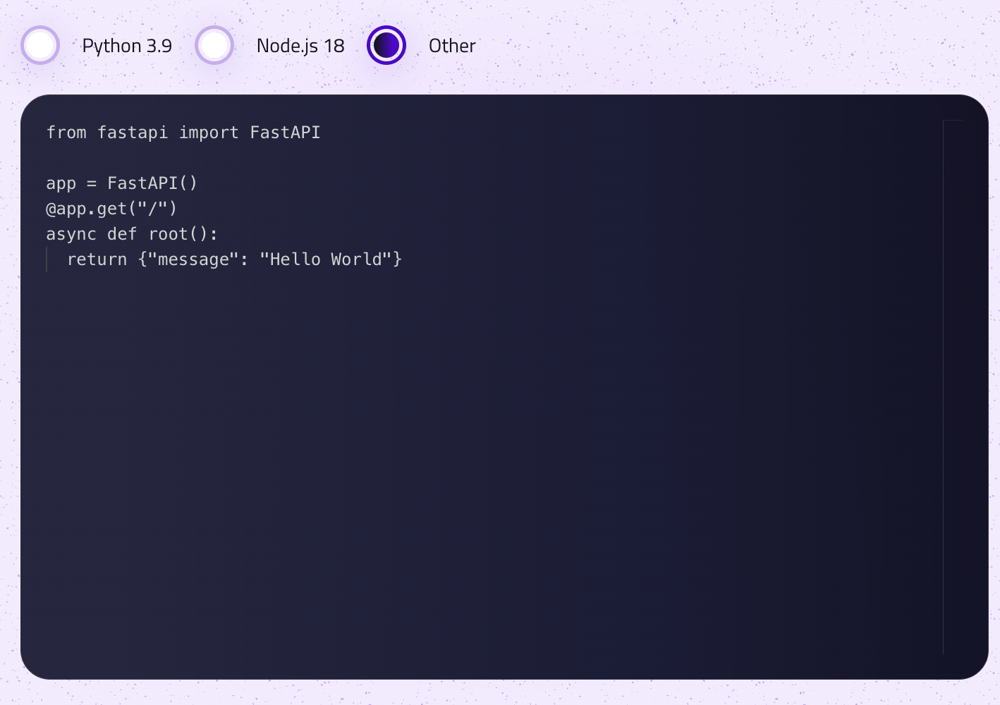

# Write Your Code Documentation

If you prefer coding directly on our platform, this guide is for you. Our integrated development environment (IDE) provides a seamless experience for writing, testing, and deploying your code. Here's how you can get started with writing your code directly on our platform.

## Getting Started with the IDE



Our IDE is designed to be intuitive and easy to use, whether you're a seasoned developer or just getting started. Here are the steps to begin coding directly within our platform:

**Select Your Language**: Before you start coding, select the programming language you will be using for your project. Currently, we support Python and Node.js.

## Writing Your Code

When writing your code directly in our IDE, there's one important requirement you need to follow:

### The `app` Function

Your code should contain an `app` function. This function acts as the entry point to your program, meaning it's where the execution of your code begins. The `app` function is crucial for our platform to correctly execute and interact with your code. Here's what you need to keep in mind:

- **For Python**: Define an `app` function within any of your Python files. This function will be the starting point of your application.
  
  ```python
  def app():
      # Your code here