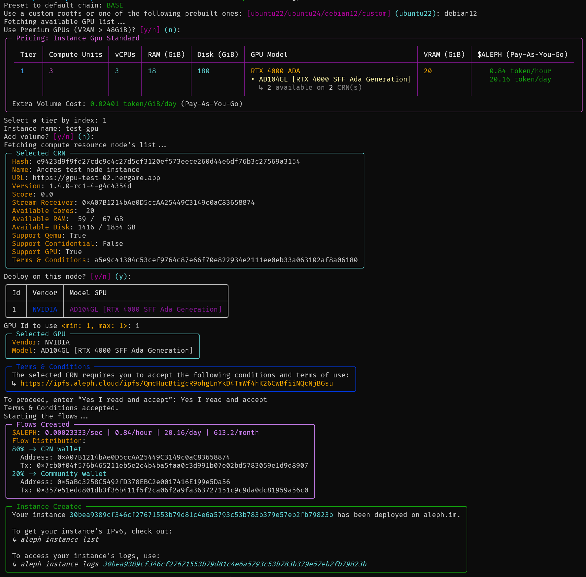

# GPU Instance Creation and Configuration

This section outlines the process of starting a GPU instance on the Aleph Network and configuring the GPU on it.

The [aleph-client](https://github.com/aleph-im/aleph-client/) command-line tool is required.<br>
See [CLI Reference](../../tools/aleph-client/usage.md) or use `--help` for a quick overview of a specific command.

## Setup

### Create an instance with GPU

The CLI provides a streamlined command to create a GPU instance. You will be prompted to choose a specific GPU available on a compatible CRN (Compute Resource Node), where your instance will be deployed. Alternatively, you can create your GPU instance on [Twentysix Cloud](https://console.twentysix.cloud/).

```shell
aleph instance gpu
```



Your VM is now ready to use.

### Retrieve VM Logs

Monitor your VM's activity:

```shell
aleph instance logs <vm-hash>
```

### Access Your VM via SSH

#### 1. **Find the Instance Details**

- **Via CLI**:

```shell
aleph instance list
```

- **Via API**: Access the compute node's API at `https://<node-url>/about/executions/list`.

#### 2. **Connect via SSH**:

Use the retrieved IP address to SSH into your VM:

```shell
ssh <user>@<ip> [-i <path-to-ssh-key>]
```

- **Default Users**:
  - Debian: `root`
  - Ubuntu: `ubuntu`

## Using the GPU inside your VM

### Install NVIDIA Linux Drivers

#### 1. **Installation**

##### **Debian**

```shell
echo "deb http://deb.debian.org/debian/ bookworm main contrib non-free non-free-firmware" >> /etc/apt/sources.list
apt update -y && apt upgrade -y && apt autoremove -y
```

> ℹ️ If prompted, press Enter for `Keep the local version currently installed`.

Exit your vm and then reboot it with:

```shell
aleph instance reboot <vm-hash>
```

Re-connect to your VM via SSH and run the following:

```shell
apt install linux-headers-$(uname -r) nvidia-driver software-properties-common -y
```

##### **Ubuntu**

```shell
apt update -y && apt upgrade -y && apt autoremove -y
apt install ubuntu-drivers-common --fix-missing -y
ubuntu-drivers --gpgpu install
```

> ℹ️ If prompted, just press Enter.

#### 2. **Verify the Installation**

To simply check that the installation went well, run the following:

```shell
nvidia-smi
```

Alternatively, you can try to run [ollama](https://ollama.com/) using the GPU:

```shell
curl -fsSL https://ollama.com/install.sh | sh
ollama run deepseek-r1:1.5b "Why use a decentralized cloud?" --verbose
```

### Install NVIDIA CUDA Toolkit

Ensure you already have the NVIDIA drivers installed.

#### 1. **Installation**

The following commands are usable for both Debian and Ubuntu.

```shell
distrib=$(echo "$(lsb_release -si | tr '[:upper:]' '[:lower:]')$(lsb_release -sr | tr -d '.')")
wget https://developer.download.nvidia.com/compute/cuda/repos/$distrib/x86_64/cuda-keyring_1.1-1_all.deb && dpkg -i cuda-keyring_1.1-1_all.deb && rm cuda-keyring_1.1-1_all.deb
apt update -y && apt install cuda-toolkit -y
echo "export PATH=/usr/local/cuda/bin:$PATH" >> ~/.bashrc && source ~/.bashrc
```

#### 2. **Verify the Installation**

To simply check that the installation went well, run the following:

```shell
nvcc --version
```
