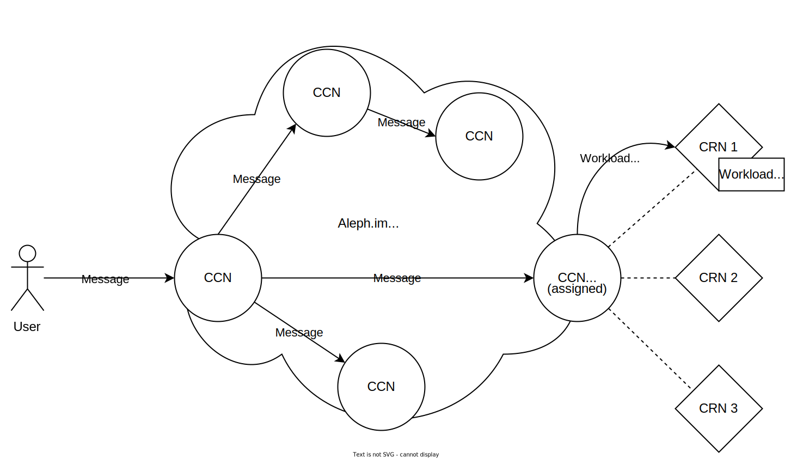

# Overview

Welcome to the Aleph.im documentation. This site will provide you with all the necessary
information, resources, and tools to get started with the Aleph.im project. 

## What is Aleph.im?

[Aleph.im](https://aleph.im) is an open-source off-chain P2P (peer-to-peer) network. 
It offers decentralized key-value store, file storage, function execution and virtual machine provisioning.
Interactions with the network rely on decentralized identities that are interoperable with many major blockchain networks, 
such as Ethereum, Tezos, and Solana.

This enables interactions between the Aleph.im network and blockchain networks. Bridges also allow smart contracts to 
interact with the Aleph.im network. 

Aleph.im also provides a blockchain indexing framework, allowing developers to index data from any blockchain network
by leveraging the Aleph.im network's decentralized storage and compute capabilities.

### The Aleph.im project has the following components:

* The Aleph peer-to-peer network, comprised of [Compute Resource Nodes or CRNs](nodes/compute/index.md) and [Core Channel Nodes, or CCNs](nodes/core/index.md)
* [Python](libraries/python-sdk/index.md) and [TypeScript](libraries/typescript-sdk/index.md) SDKs to integrate Aleph.im's decentralized compute and storage solutions into your project
* A [Python command-line tool](tools/aleph-client.md) to interact with the Aleph.im network directly from a terminal
* A [Web Console](https://console.twentysix.cloud/) to create and manage cloud resources
* A [Node Operator Dashboard](https://account.aleph.im/)
* A [Message Explorer](https://explorer.aleph.im/)

## The Aleph.im network

The Aleph.im network is composed of 2 sets of nodes:

* [CCNs](nodes/core/index.md), the backbone of the P2P network. They serve as an entry point into the network through an API (similar to a blockchain node's RPC).
* [CRNs](nodes/compute/index.md), responsible for the actual compute and storage available on Aleph.im. CRNs must be tied manually to a single CCN, and each CCN is incentivized to tie up to 3 CRNs.

### Messages
In Aleph.im terminology, a "_message_" is similar to a "_transaction_" for a blockchain: it is a set of data sent by an end user, propagated through the entire peer-to-peer network.
A message can be generated using either the [Python SDK](libraries/python-sdk/index.md) or [TypeScript SDK](./libraries/typescript-sdk/index.md), or through [aleph-client](tools/aleph-client.md) or the [Console](https://console.aleph.im/).

These messages can contain several different instructions, such as reading or writing [posts](libraries/python-sdk/posts.md), [programs/functions](computing/index.md), or [indexing data](tools/indexer.md) created on external blockchains.

### Payment

Aleph does not operate as a blockchain but utilizes its native cryptocurrency, 
referred to as the _ALEPH_ token, which functions across various blockchains.

This token serves two primary purposes: support users payments for the resources they
allocate on the network, and incentivize node operators to maintain the network's integrity.

The first payment implementation is achieved through a staking mechanism, 
where users must hold a certain amount of ALEPH tokens to use the network's resources.
This mechanism is in place for file storage and for persistent virtual machines.

In January 2024, the network started supporting a new payment model, together with the launch
of the [TwentySix Cloud](https://www.twentysix.cloud/) platform, 
where users pay using streams of ALEPH tokens on compatible chains.

### Example
Let's take the example of a user who wants to run a program on the Aleph.im network:

1. The user makes sure to have an Ethereum wallet holding a sufficient number of ALEPH tokens
2. The user writes and sends a message using either the aleph python client, one of the SDKs, or the web dashboard
3. The message arrives at a CCN, which then broadcasts that message to all CCNs in the network
4. The "program" workload scheduled by the user's message gets assigned to one of the CCNs
5. The assigned CCN now assigns that workload onto one of its CRNs
6. The assigned CRN starts a virtual machine executing the user's requested workload.

## Where to start?

- Use our [Python SDK](libraries/python-sdk/index.md) and [TypeScript SDK](./libraries/typescript-sdk/index.md).
- Follow a [Tutorial to run Python code on aleph.im](guides/python/getting_started.md).
- Become part of the network by managing a [Core Channel Node](nodes/core/index.md) or a [Compute Resource Node](nodes/compute/index.md).
- Trouble setting up your node? Check out our [Troubleshooting Guide](nodes/compute/troubleshooting.md).

## Community

- Chat on our [Telegram group](https://t.me/alephim).
- Engage on our [Discourse Channel](https://community.aleph.im/).
