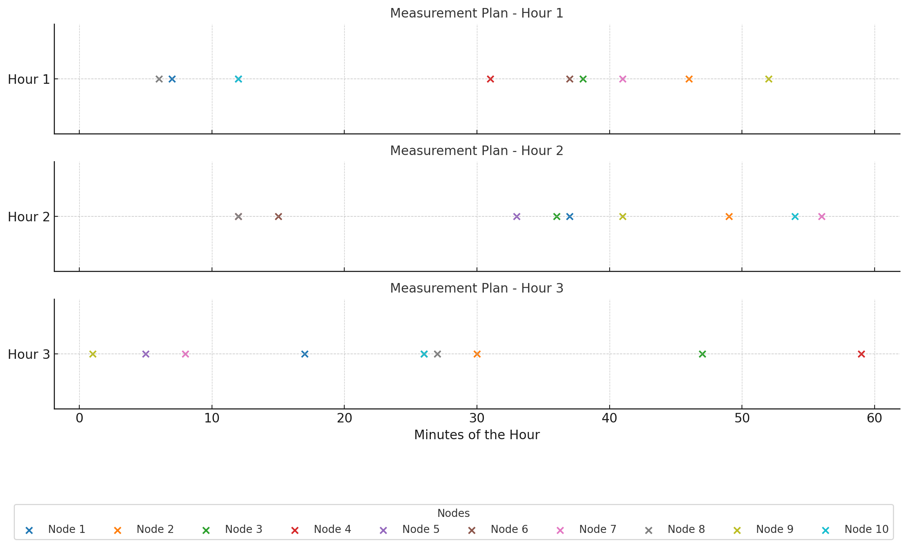
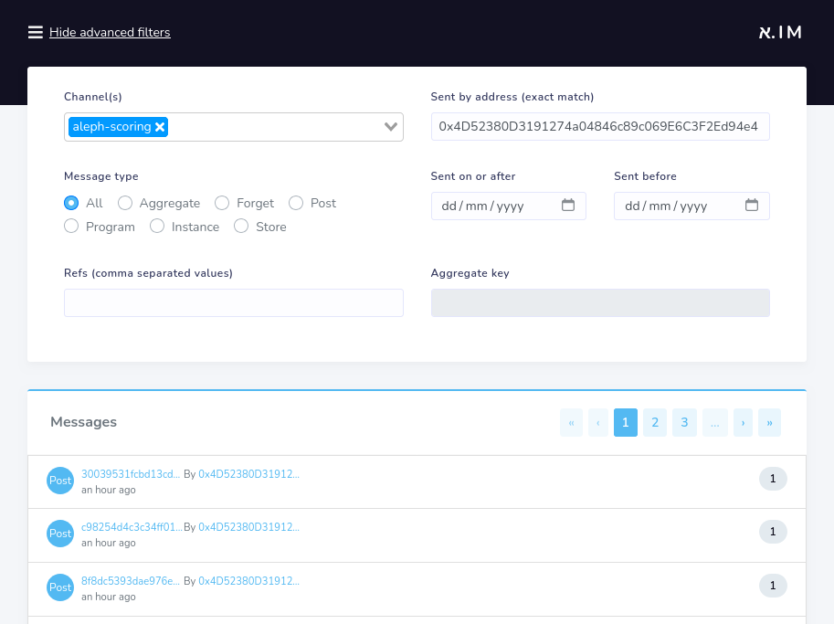
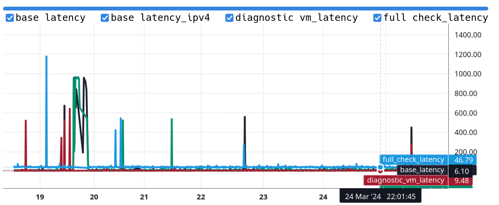

# Metrics

Metrics are measurements of the performance and reliability of the nodes.

A program measures every hour the status and performance of the nodes, and publishes this data messages on the aleph.im network.
This program sends multiple HTTP requests to each node in order to evaluate how well it behaves.

The measurement program is part of the open-source [aleph-scoring](https://github.com/aleph-im/aleph-scoring/) project. All source code
is available on that repository.

## Method

The measurement program is deployed on a collection of servers on different continents in order to reduce geographical bias.

Every hour, the measurement program creates a random plan of when to connect to each node for measurements over the following hour. It then follows this plan, connecting to every node in the network over that hour.



The program connects to each node using a few different methods and measures the time taken to obtain a response for each measurement (latency).

- HTTP or HTTPS
- IPv4 and IPv6
- Ping (ICMP) requests

All durations are expressed in seconds (floating numbers).

When a test fails, the corresponding field is not included in the results.

At the end of the hour, the program publishes the results in JSON in the form of a [POST](../../protocol/object-types/posts.md) message with the type `aleph-scoring-metrics`.

Production metrics are signed by the address `0x4D52380D3191274a04846c89c069E6C3F2Ed94e4`.

> 🔗 See [the metrics messages on the exporer](https://explorer.aleph.im/messages?showAdvancedFilters=1&channels=aleph-scoring&page=1&sender=0x4D52380D3191274a04846c89c069E6C3F2Ed94e4)

## Common metrics

Some metrics are common to all node types:

1. **Software version** (`version`): We compare the version of the node to the latest version available. Node operators have a grace period to update their node to the latest release.
2. **Automatic System Number (ASN)** (`asn`): Gives a rough estimate of where the server is located. This helps us score the decentralization of the nodes. The `as_name` field contains the name.
3. **ASN Name** (`as_name`): The name of the Autonomous System Number (ASN) of the node.
4. **Measured at** (`measured_at`): The timestamp of the measurement for this specific node.

## Metrics for Core Channel Nodes

1. **Base latency** (`base_latency`): The time to respond to a simple request, measured by calling `/api/v0/info/public.json` (no processing on that page).
2. **Metrics latency** (`metrics_latency`): The time to fetch public node metrics, measured by calling `/metrics.json`
   [//]: # (3. The following variables from the metrics.json response:)
   [//]: # ( a. `pyaleph_status_sync_pending_txs_total`)
   [//]: # ( b. `pyaleph_status_sync_pending_messages_total`)
   [//]: # ( c. `pyaleph_status_chain_eth_height_remaining_total`)
3. **Aggregate latency** (`aggregate_latency`): The time to fetch a large aggregate, measured by calling `/api/v0/aggregates/0xa1B3bb7d2332383D96b7796B908fB7f7F3c2Be10.json?keys=corechannel&limit=50`. Accesses the database.
4. **File download latency** (`file_download_latency`): The time to fetch a 6.7 kB file, measured by calling `/api/v0/storage/raw/50645d4ccfddb7540e7bb17ffa5609ec8a980e588e233f0e2c4451f6f9da6ebd`. Accesses the storage
5. **Pending messages** (`pending_messages`): The number of messages in queue to be processed. Should be low except on new nodes still syncing.
6. **Pending transactions** (`txs_total`): The number of archives to be fetched from IPFS and processed. Should be very low except on new nodes still syncing.
7. **Ethereum height remaining** (`eth_height_remaining`): Number of [blocks](https://ethereum.org/en/developers/docs/blocks/) available on Ethereum that are newer than the newest archive processed.

Metrics are only valid if the HTTP response code is a success.

The metrics for a CCN have the following form:

```json
{
  "measured_at": 1680715202.614388,
  "node_id": "5891b5b522d5df086d0ff0b110fbd9d21bb4fc7163af34d08286a2e846f6be03",
  "url": "http://12.13.14.15:4024/",
  "asn": 12345,
  "as_name": "INTERNET-SERVICE-PROVIDER, AD",
  "version": "v0.5.0",
  "base_latency": 0.0545351505279541,
  "metrics_latency": 0.05013394355773926,
  "aggregate_latency": 0.03859257698059082,
  "file_download_latency": 0.04321122169494629,
  "txs_total": 0,
  "pending_messages": 3430570,
  "eth_height_remaining": 114822,
}
```

## Metrics for Compute Resource Nodes

All measurements for Compute Resource Nodes are done in [IPv6](https://en.wikipedia.org/wiki/IPv6).

1. **Base latency** (`base_latency`): The time to respond to a simple request, measured by calling `/about/login` (no processing on that endpoint). Should return HTTP code `401 Unauthorized`.
2. **Diagnostic VM latency** (`diagnostic_vm_latency`): The time to call a common user program and get a response, measured by calling `/vm/67705389842a0a1b95eaa408b009741027964edc805997475e95c505d642edd8`
3. **Full check latency** (`full_check_latency`): The time to run a collection of checks on the node and get a response, measured by calling `/status/check/fastapi`.
4. **Diagnostic VM Ping latency** (`diagnostic_vm_ping_latency`): The time returned by an [ICMP Ping](<https://en.wikipedia.org/wiki/Ping_(networking_utility)>) to the diagnostic virtual machine running on the node. This metric is only present if the VM is available via IPv6 (VM Egress IPv6).
5. **Base latency Ipv4** (`base_latency_ipv4`): The time same as `base_latency` above but using IPv4 instead of IPv6.
6. **Features** (`features`): Special features supported by the node. Currently, the following features are supported:
     - `sev`: Secure Enclave Virtualization
     - `sev_es`: Secure Enclave Virtualization with Egress Security

The metrics for a CRN have the following form:

```json
{
    "asn": 12345,
    "url": "https://node01.crn.domain.org/",
    "as_name": "INTERNET-SERVICE-PROVIDER, AD",
    "node_id": "8cd07f3a5ff98f2a78cfc366c13fb123eb8d29c1ca37c79df190425d5b9e424d",
    "version": "1.3.0",
    "features": [
      "sev",
      "sev_es"
    ],
    "measured_at": 1680715253.669524,
    "base_latency": 0.9623174667358398,
    "base_latency_ipv4": 0.9732174667358398,
    "diagnostic_vm_latency": 0.06729602813720703,
    "full_check_latency": 0.5257446765899658,
    "diagnostic_vm_ping_latency": 0.148196
}
```

## Analyzing

The [scores](../../nodes/reliability/scores.md) are computed based on the metrics, in a reproducible manner.

Metrics messages can be found:

### On the Message Explorer

Browser the metrics messages on the [Aleph.im Explorer](https://explorer.aleph.im/messages?showAdvancedFilters=1&channels=aleph-scoring&sender=0x4D52380D3191274a04846c89c069E6C3F2Ed94e4).

[https://explorer.aleph.im/messages?showAdvancedFilters=1&channels=aleph-scoring&sender=0x4D52380D3191274a04846c89c069E6C3F2Ed94e4](https://explorer.aleph.im/messages?showAdvancedFilters=1&channels=aleph-scoring&sender=0x4D52380D3191274a04846c89c069E6C3F2Ed94e4)



### On the `Node-metrics` visualizer

This service provides a web interface to visualize the last two weeks of metrics for a specific nodes, leveraging
the node metrics API described below.

[https://node-metrics.aleph.cloud/](https://node-metrics.aleph.cloud/)



### Using the node metrics API

The [node metrics API](https://docs.aleph.im/nodes/reliability/monitoring/#node-metrics) provides a convenient way to 
obtain the last two weeks of metrics for a specific node instead of extracting the data from the metrics messages.

The last two weeks of metrics of a specific node can be fetched from any Core Channel Node (CCN) by using the following
endpoint: 

 - For Core Channel Nodes: `/api/v0/core/${node.hash}/metrics`
 - For Compute Resource Nodes: `/api/v0/compute/${node.hash}/metrics`

Examples: 

 - [https://official.aleph.cloud/api/v0/core/6c7578899ac475fbdc05c6a4711331c7590aa6b719f0c169941b99a10faf1136/metrics](https://official.aleph.cloud/api/v0/core/6c7578899ac475fbdc05c6a4711331c7590aa6b719f0c169941b99a10faf1136/metrics)
 - [https://official.aleph.cloud/api/v0/compute/ec6ff7010de501b292333f390a46a227e349de6425fde4bd47d06ade82d3786c/metrics](https://official.aleph.cloud/api/v0/compute/ec6ff7010de501b292333f390a46a227e349de6425fde4bd47d06ade82d3786c/metrics)

### Using the HTTP _messages_ API

```shell
curl "https://official.aleph.cloud/api/v0/messages.json?" \
    "addresses=0x4D52380D3191274a04846c89c069E6C3F2Ed94e4&" \
    "channels=aleph-scoring&" \
    "startDate=1727775567&" \
    "endDate=1727861984&" \
    "content_types=aleph-network-metrics"
```

### Using the Python SDK

The [Python SDK](../../libraries/python-sdk/posts/query.md) provides helpers to fetch the relevant messages.

```python
import asyncio
from datetime import UTC, datetime, timedelta

from aleph_message.models import PostMessage

from aleph.sdk.client import AlephHttpClient
from aleph.sdk.query.filters import PostFilter


async def get_metrics():
    async with AlephHttpClient() as client:
        response = await client.get_posts(
            post_filter=PostFilter(
                types=["aleph-network-metrics"],
                addresses=["0x4D52380D3191274a04846c89c069E6C3F2Ed94e4"],
                channels=["aleph-scoring"],
                start_date=datetime.now(tz=UTC) - timedelta(hours=4),
                end_date=datetime.now(tz=UTC),
            )
        )
        return response.posts


messages = asyncio.run(get_metrics())
message: PostMessage
for message in messages:
    print(message.item_hash)
```


