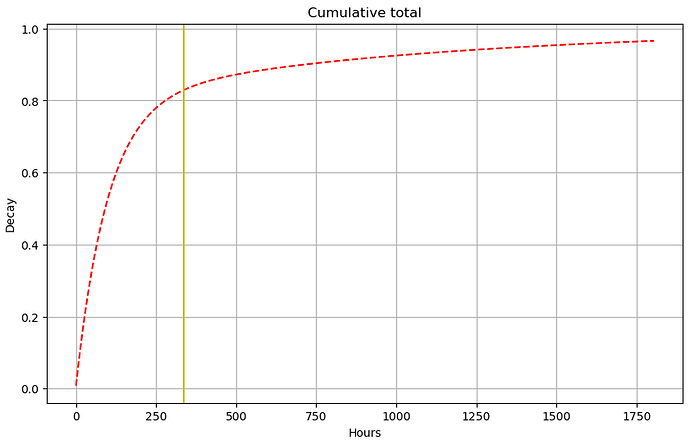
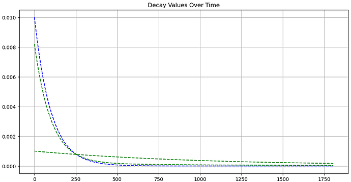

# Scores

Scores are computed for each node from the [metrics](metrics.md) and span a scale from 0 to 100%.

- A score below 20% indicates that the node is dysfunctional and should not be used.
- A score above 80% indicates that the node is fully functional and behaves well.

The computation algorithm is based on the principles below. It is being tuned to take into account the reality of
the nodes of the network, and feedback from community and node operators in particular is welcome.

## Objectives

The score is computed daily and is based on all past [metrics](metrics.md) about a node.

A new node starts with a score of `0%` and is expected to reach a score above `80%` after two or three weeks of operation
when performing well. The score is based on the last two years of metrics, with recent metrics having a higher weight.

Percentiles are used when processing numeric metrics to ensure that the score is not affected by outliers.

This provides a resistance against noise in metrics, making the score relatively stable over time. The value of the score is
therefore representative of the global behaviour of a node and is not expected to change quickly.

This helps users to identify nodes that are reliable and performant, with a bonus for nodes that have been running well
for a long time.

## Methodology

The score is computed using an SQL query on the metrics. The query can be run on the database of any
[Core Channel Node](../core/index.md) (CCN). A Core Channel Node operated by aleph.im regularly 
[publishes](#publishing) the scores.

## How the score is computed

1. A multiplier is computed for every hour in the past, based on a combination of two geometric distributions. 

    $$geometric\_pmf(p, x) = (1 - p) \cdot p^{x - 1}$$
    
    $$
      multipler = geometric\_pmf(p1, hours\_difference) \cdot m1 \\
      + geometric\_pmf(p2, hours\_difference) \cdot m2
    $$
    
    Here, $p1$ is adjusted to emphasize recent metrics, while $p2$ is tuned to favour older metrics.

    Meanwhile, $m1$ and $m2$ serve as proportional multipliers to ensure the total remains within the range $[0..1]$.
    
    

2. For every hour, a partial score based on the metrics measured that hour. When multiple metrics are present, the 67th percentile is used (the worst third is ignored). The partial scores are multipled together and fractional exponents remove the bias from the multiplication. When the version of the software running that hour was invalid, the partial score is set to zero.

3. The multiplier and partial scores are multiplied for every hour of the last years.

    $$score = \sum_{h=-1}^{history} multiplier(h) * partial\_score(h) * version\_valid * tuning$$
    
    The $tuning$ a number tuned such that most nodes have a score between `80%` and `100%`.

## Publishing

Scores are published as a POST message on aleph.im, with the type `aleph-scoring-scores`.

You can [find the scores on the aleph.im Explorer](
https://explorer.aleph.im/address/ETH/0x4D52380D3191274a04846c89c069E6C3F2Ed94e4).
