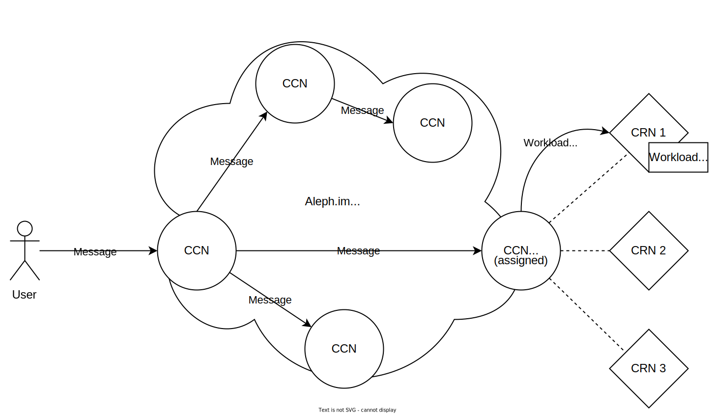

# Overview

## What is Aleph.im?

Aleph.im is an open-source off-chain P2P (peer-to-peer) network. It offers decentralized volumes and blockchain indexing, function execution and VM provisioning, as well as a DID (decentralized identity) framework.
Aleph.im also includes bridges to many major blockchain networks, such as Ethereum (or any EVM-compatible blockchain), Tezos and Solana, to enable smart contracts access to the resources and hosted on the Aleph.im network.

### The Aleph.im project has the following components:

* The Aleph peer-to-peer network, comprised of [Compute Resource Nodes or CRNs](nodes/Compute_(CRN)/index.md) and [Core Channel Nodes, or CCNs](nodes/Core_(CCN)/index.md)
* [Python](./libraries/python.md) and [Typescript](./libraries/typescript.md) SDKs to integrate Aleph.im's decentralized compute and storage solutions into your project
* A [Python CLI tool](https://aleph-client.readthedocs.io/en/latest/) to interact with the Aleph.im network directly from a terminal
* A [web GUI dashboard](https://console.aleph.im/)
* An [Explorer](https://explorer.aleph.im/)

## The Aleph.im network

The Aleph.im network is composed of 2 sets of nodes:

* [CCNs](nodes/Core_(CCN)/index.md), the backbone of the P2P network. They serve as an entry point into the network through an API (similar to a blockchain node's RPC).
* [CRNs](nodes/Compute_(CRN)/index.md), responsible for the actual compute and storage available on Aleph.im. CRNs must be tied manually to a single CCN, and each CCN is incentivized to tie up to 3 CRNs.

### Messages
In Aleph.im terminology, a "message" is similar to a "transaction" for a blockchain: it is a set of data sent by an end user, propagated through the entire peer-to-peer network.
A message can be generated using either the [python](./libraries/python.md) or [typescript](./libraries/typescript.md) SDKs, or through the [aleph-client](https://aleph-client.readthedocs.io/en/latest/) or the [web dashboard](https://console.aleph.im/).
These messages can contain several different instructions, such as reading or writing [posts](https://aleph-client.readthedocs.io/en/latest/content/posts.html#), [programs/functions](./computing/persistent.md), or [indexing data](./frameworks/indexer.md) created on external blockchains.

### Payment
While Aleph is not a blockchain. It uses the ALEPH token hosted on Ethereum to manage users' payments and offer network integrity and workload execution rewards to node operators. Because of this, you must have an EVM-compatible wallet (such as Metamask) provisioned with some ALEPH tokens to write to the network.

### Example
Let's take the example of a user who wants to run a program on the Aleph.im network:

1. The user makes sure to have an Ethereum wallet with at least 2000 ALEPH tokens
2. The user writes and sends a message using either the aleph python client, one of the SDKs, or the web dashboard
3. The message arrives at a CCN, which then broadcasts that message to all CCNs in the network
4. The "program" workload scheduled by the user's message gets assigned to one of the CCNs
5. The assigned CCN now assigns that workload onto one of its CRNs
6. The assigned CRN creates a micro-vm executing the user's requested workload.