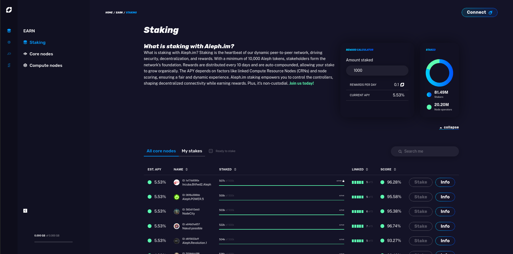

# Account dApp

Access features of aleph.im from your web browser using the
[aleph.im account dApp](https://account.aleph.im/).

Access information about the nodes that make the network, and their performance.

Connect your wallet using Metamask or Wallet Connect in order to stake or
manage [Core Channel Nodes](../nodes/core/index.md) and
[Compute Resource Nodes](../nodes/compute/index.md) that you operate.

