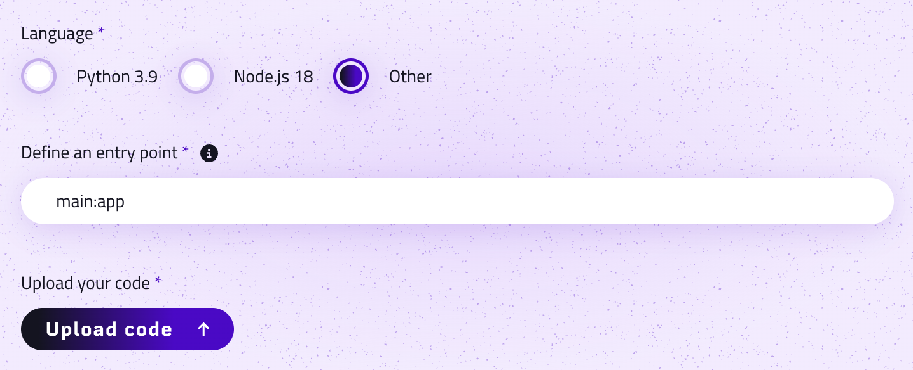

# Code Upload Documentation

This guide provides a comprehensive overview of how to prepare and upload your code to our platform. You will be able to easily integrate your projects and get them running smoothly.

## Preparing Your Code

Before uploading, it's essential to ensure your code is correctly prepared to meet our requirements. This includes selecting the right language, packaging your project, and defining the entry point.

### Selecting Your Language

Currently, our platform supports two programming languages:

- **Python**
- **Node.js**
- **Other**

Ensure your project is developed in one of these languages before proceeding with the upload process.

### Packaging Your Project

Your code should be compressed into a `.zip` or `.sqsh` (squashfs) file for the upload. This step is crucial for a successful integration. Here are some tips for packaging your project:

- Place your main file (e.g., `main.py` for Python projects or `run.sh` for Node.js projects) at the root of your package.
- Ensure all necessary dependencies are included in your package. For Python, a `requirements.txt` file is recommended. For Node.js, include the `node_modules` folder or provide a `package.json` file.

### Defining the Entry Point

The entry point is the name of the script or file used to invoke your function, serving as the 'doorway' to your code. It's crucial to correctly specify this to ensure your code runs as intended.

#### Python
- Example: If your main file is `main.py` and it contains a function named `app`, your entry point would be `main:app`.

#### Node.js
- Example: If your primary file is `index.js`, your entry point is simply `index.js`.

Different languages and frameworks have unique conventions for entry points. It's essential to follow the specific guidance for your chosen language or framework.

## Uploading Your Code

Once your code is prepared, follow these steps to upload it to our platform:

1. Navigate to the code upload section on our platform by creating a new function.
2. Choose your prepared `.zip` or `.sqsh` file.
3. Select the language your code is written in.
4. Specify the entry point for your code based on the guidelines provided above.
5. Upload your code package.

After uploading, our platform will process your code and prepare it for execution. Ensure you've followed all the steps correctly to avoid any issues with your project's integration.

## Conclusion

Uploading your code to our platform is a straightforward process designed to be as smooth and user-friendly as possible. By preparing your code according to the guidelines outlined in this document, you'll ensure a seamless integration and a great start to using our services. 

We're excited to see what you'll build!