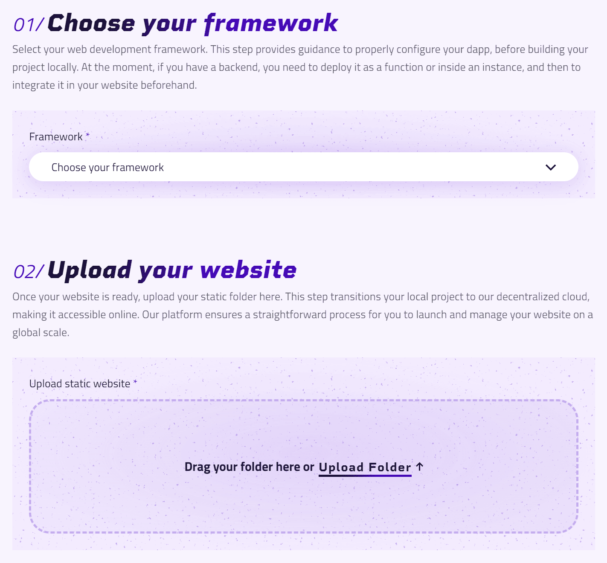
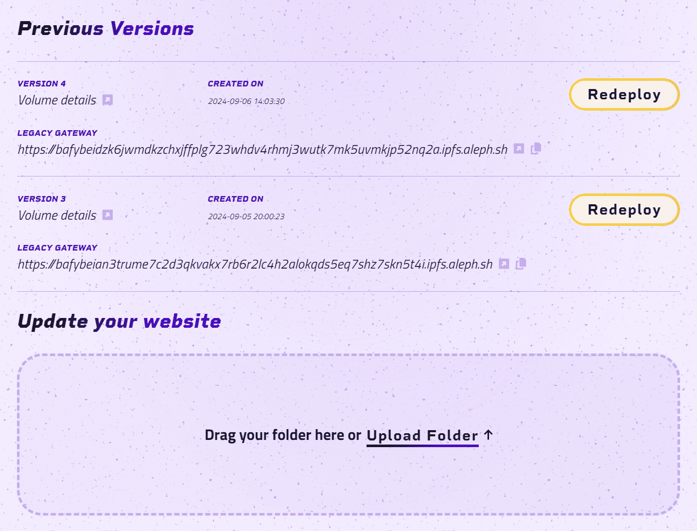
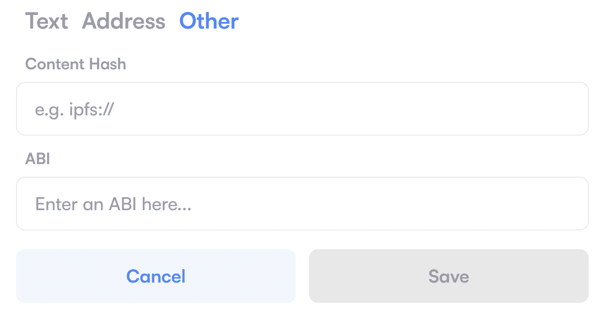

# Web3 Hosting on Aleph.im

## Overview

Aleph.im offers web3 hosting services via the [Twentysix Cloud Console](https://console.twentysix.cloud/), allowing you to deploy any kind of Dapps in few simple steps. Your websites are stored on IPFS and are fully-managed by the Aleph network.

Aleph.im being GDPR-compliant, if you decide to delete your website, or some older versions of it (previous deployments), or if you stop holding the required amount of tokens to keep it online, your website will be automatically garbage collected after a grace period by our network.

> ℹ️ IPFS being a public P2P network, your files may still be available over the network if external nodes pinned them.

## Getting started

### Pricing

In order to host a website on Aleph.im, you need to hold a small amount of $ALEPH token in your wallet. Those tokens are not locked or staked (no transaction required), and will not be spent, they just have to sit in your wallet as a guarantee. To run a cost simulation, check out the [deployment page](https://console.twentysix.cloud/hosting/website/new/).

### Prepare

You need to provide a root folder containing your static website's files.

#### Simple Static Website

The minimal requirement is that your folder must contain an `index.html` file. This file will always be the entrypoint of your website.

```bash
static-folder
├── index.html [required]
├── style.css
├── script.js
├── assets
:   └── ...
```

#### Framework-based Website

We are listing the officially supported frameworks on TwentySix's website creation page, but you can actually use any framework (and package manager, such as npm, pnpm, yarn, bun...) to create your website.

> ℹ️ Keep in mind that your website, being a decentralized frontend, must only contain client-side components, as well as the dependencies used by it. For backend support, check out the section below.

##### Build

When your project is ready, you can build and generate your static folder.
Example using npm:

```bash
npm install
npm run build
```

> ℹ️ The name of the output folder depends on the framework used, it's usually `out` or `dist`.

### Deploy

When your static folder is ready, you can deploy your website using the [Twentysix Cloud Console](https://console.twentysix.cloud/hosting/website/new/).



### History and Updates

You can update your website or access/redeploy previous versions easily through your [Website Management Dashboard](https://console.twentysix.cloud/hosting/website/).



## Access Your Dapp

### Aleph Gateway Service

When your website is live on Aleph network, we provide you a gateway url to easily access it:

`https://{ipfs-cid-v1}.ipfs.aleph.sh`

You can also access it in a similar fashion using alternative gateways, since your website is hosted on IPFS.
Find alternative gateways [here](https://ipfs.github.io/public-gateway-checker/).

### Custom Domains

At deployment time, or later, you can link a custom domain to your website using:

- [Aleph-Client](aleph-client/index.md)
- [Twentysix Cloud Console](https://console.twentysix.cloud/settings/domain/new/)

### ENS Domains

Since your website is hosted on IPFS, it is compatible with ENS domains.<br>
To resolve it:

- Access your domain page on [ens.domains](https://app.ens.domains/)
- `Records` ➜ `Edit Records` ➜ `Other`
- Setup `Content Hash` to: `ipfs://{ipfs-cid-v1}`



Your website will then be accessible via:

`https://{ens-domain}.eth.limo`<br>
or<br>
`https://{ens-domain}.eth.link`

## Advanced Features

### Handle Redirections on IPFS

By default, IPFS can't handle any fallback redirections, so we provide a `404 fallback` for all routes that are not found.

If you want to add more specific redirections, you must create a `_redirects` file into your dapp:

- <b>Simple website</b>: It should be located in the root folder.
- <b>Framework-based website</b>: it should be located in the `public` folder. At build time, it will be moved at the root.

Check out the IPFS documentation below for more details.

<b>Useful Links</b>

- [IPFS docs](https://docs.ipfs.tech/how-to/websites-on-ipfs/redirects-and-custom-404s/)
- [Specifications](https://specs.ipfs.tech/http-gateways/web-redirects-file/)

### Backend Support

In order to add a backend to your website and to make it a complete fullstack dapp, there are currently 2 different approchs you can implement:

- [Deploy your backend as a function](webconsole/write_your_code.md) using our serverless solution.
- [Deploy your instance](../computing/index.md) then setup your environment and expose your APIs to the internet.

> ℹ️ You should setup your backend in advance, in order to integrate the needed endpoint urls inside your website after.

### AI Integration

Now that your application is fully decentralized, you want to add some AI features to it?

Forget about OpenAI and other centralized providers, [LibertAI](https://libertai.io/), a decentralized & privacy-first Aleph.im-based AI project, allows you to perform inferences, manage knowledge bases, and deploy AI agents easily.

Have a look to the [official documentation](https://docs.libertai.io/).

### Auto-Deployment on Push

Coming soon.

## Troubleshooting

### aleph-sdk-ts

When using the Typescript SDK, some frameworks can require a specific [setup](../libraries/typescript-sdk/troubleshooting.md).

### Found an issue?

If the documentation didn't help, you can [report an issue](https://github.com/aleph-im/support/issues).
