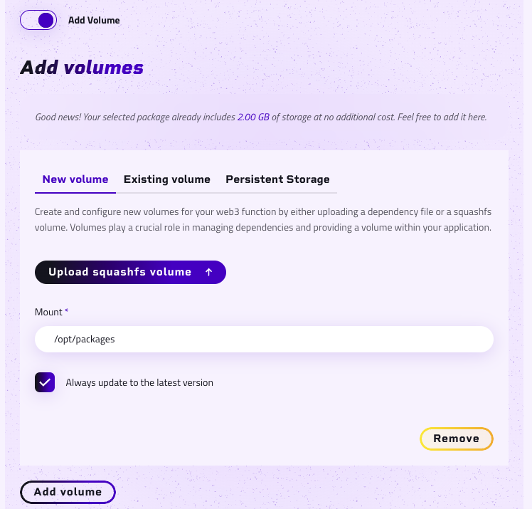

## Preparing Your Python Code with FastAPI

Before deploying your FastAPI application, it's essential to prepare it according to the platform's guidelines.

Here is an example [Python Sample](https://github.com/aleph-im/aleph-vm/tree/main/examples/example_fastapi)

### Selecting Your Language

Confirm the project is developed in Python.

### Packaging Your Project

To package a FastAPI application, organize your project as follows:

```bash
my_project/
│
├── main.py  # Your main FastAPI application file.
│
├── requirements.txt  # Optional: Dependencies must be built locally, uploaded and referenced as an immutable volume
│
└── additional_files/  # Optional: Any additional files or directories. 
    ├── __init__.py  # Optional: Init file.
    ├── models.py  # Optional: Defines data models.
    └── dependencies.py  # Optional: Contains any dependency functions.
```

1. **Main File**: Place the main FastAPI file (main.py), containing the application instance and routes, at the package's root.
2. **Dependencies**: List FastAPI and other dependencies in `requirements.txt`. Example content:
   ```
   fastapi==0.68.0
   uvicorn==0.15.0
   ```
3. **Compression**: Compress your project directory into a `.zip` or `.squashfs` files - one for the project itself and another for the packages.

Below is an example of how to create and compress your package using `squashfs`.
  ```
  pip install -t packages -r requirements.txt
  mksquashfs packages packages.squashfs
  ```

### Defining the Entry Point

The entry point is vital for the platform to recognize how to launch your FastAPI application. For a main file named `main.py`:

- **Entry Point**: Your entry point would be `main:app`, where `main` is the filename (without `.py`) and `app` is the FastAPI application instance.

## Example Code Explanation

Here is the explanation of your code snippet:

```python
from fastapi import FastAPI

app = FastAPI()
@app.get("/")
async def root():
  return {"message": "Hello World"}
```

- **FastAPI Instance**: `app = FastAPI()` creates an instance of a FastAPI application.
- **Route Definition**: `@app.get("/")` defines a route that listens for GET requests at the root URL (`/`). 
- **Async Function**: `async def root():` is an asynchronous function that handles requests to the root URL. It returns a JSON response with a message.
- **JSON Response**: `{"message": "Hello World"}` is the JSON response that clients will receive when they access the root URL.

## Uploading Your Code

After preparing your code, follow the platform's upload process:

1. **Navigate to Code Upload**: Access the code upload section by initiating a new function on the platform.
2. **Choose File**: Select your `.zip` or `.squashfs` file containing the FastAPI project.
3. **Select Language**: Choose Python as the language.
4. **Specify Entry Point**: Enter `main:app` as the entry point.
5. **Upload**: Complete the upload process.

## Set a volume
After uploading your project, you need to manually push your dependencies into a dedicated volume.

The dependencies will not be installed automatically, so you must install and upload them yourself.

To do this, navigate to the Volume section and add a new volume at `/opt/packages`.

**Make sure to use the correct name for the volume to avoid errors during deployment.**

