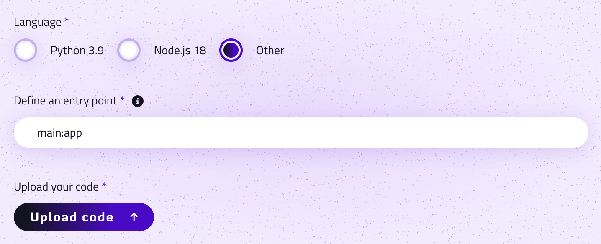

# Code Upload Documentation

This guide details the steps for preparing and uploading code to the platform, enabling straightforward project integration.

## Preparing Your Code

It is essential to prepare code to align with platform requirements, which involves selecting the appropriate programming language, packaging the project suitably, and defining an entry point.

### Selecting Your Language

The platform supports a range of programming languages, including:

- **Python**
- **Node.js**
- **Other**

Projects should be developed in a supported language to proceed with the upload process.

### Packaging Your Project

Code must be compressed into a .zip or .squashfs file for upload. Effective packaging ensures successful integration. Key packaging considerations include: Here are some tips for packaging a project:

- Positioning the main file (e.g., main.py for Python or run.sh for Node.js) at the package's root.
- For python projects:
  - use a `requirements.txt` to build the dependencies of your program locally then, zip it into a `.squashfs` and upload it as a volume, mapped on `/opt/packages`.
- Concerning Node.js projects:
  - use a `package.json` to build the dependencies of your program locally then, zip it into a `.squashfs` and upload it as a volume, mapped on `/opt/node_modules`.

### Defining the Entry Point

The entry point, the initial script or file triggering the function, needs precise specification to guarantee correct code execution.

#### Python
- Example: For a main file named `main.py` with a function called app, the entry point would be `main:app`.

#### Node.js
- Example: For a primary file named `index.js`, the entry point is the `run.sh` file.

Different languages and frameworks have unique conventions for entry points. It's essential to follow the specific guidance for the chosen language or framework.

## Uploading Your Code

To upload code to the platform, the following steps are advised:

1. Access the code upload section by creating a new function.
2. Choose the `.zip` or `.squashfs` file prepared earlier.
3. Select the programming language of the code.
4. Define the entry point according to the above guidelines.
5. Proceed with the upload of the code package.

Post-upload, the platform processes the code for execution. Following these steps ensures integration without issues.