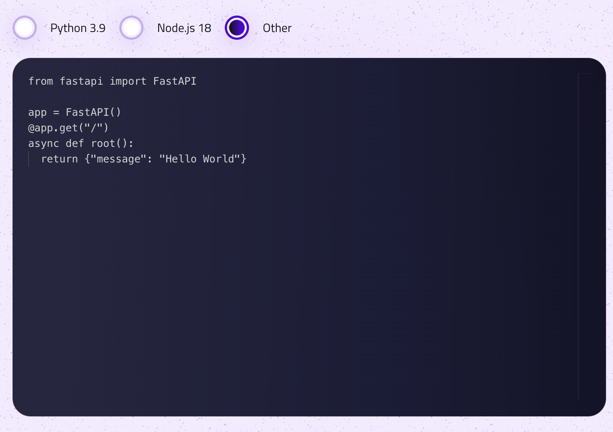

# Write Your Code Documentation

This guide is tailored for developers who opt to code directly within the platform's integrated development environment (IDE). The IDE offers a comprehensive environment for writing, testing, and deploying code efficiently.

## Getting Started with the IDE

The IDE offers a user-friendly interface, designed to accommodate both novice and experienced developers. Here's how to begin coding directly on the platform:



### Select Your Language

Start by choosing the programming language for your project. The platform supports various languages, including:

- Python
- Node.js
- Other

## Writing Your Code

For optimal interaction with the platform, your code should feature an app function, serving as the primary entry point.

### The `app` Function

- **Python**: In Python, the `app`, which is an ASGI Application, should be defined in any of the files, acting as the entry point of your application.
  
  ```python
  app = FlaskAPI()
  # Your Python code here
  ```
  
  For detailed Python-specific guidelines, please see [Python Documentation](./languages/python.md).

- **Node.js**: In Node.js, the app function should be defined in the main file, initiating the application.
  
  ```javascript
  function app() {
      // Your Node.js code here
  }
  ```
  
  Refer to [Node.js Documentation](./languages/nodejs.md) for more on Node.js best practices.

- **Other**: For languages other than Python and Node.js, ensure to define an equivalent entry function or method that complies with the execution standards of the respective language.
  
   Consult [Other Languages Documentation](./languages/other.md) for specifics on other supported languages.

## Uploading and Executing Your Code

After writing your code in the IDE:

1. **Review and Test**: Ensure your code runs correctly within the IDE.
2. **Upload**: Follow the platform-specific instructions to upload your code.
3. **Execute**: After upload, the code is ready for execution directly on the platform.

